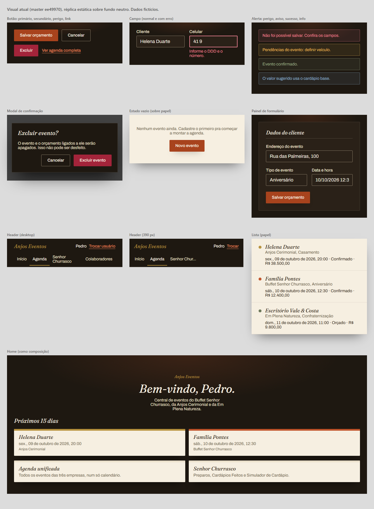
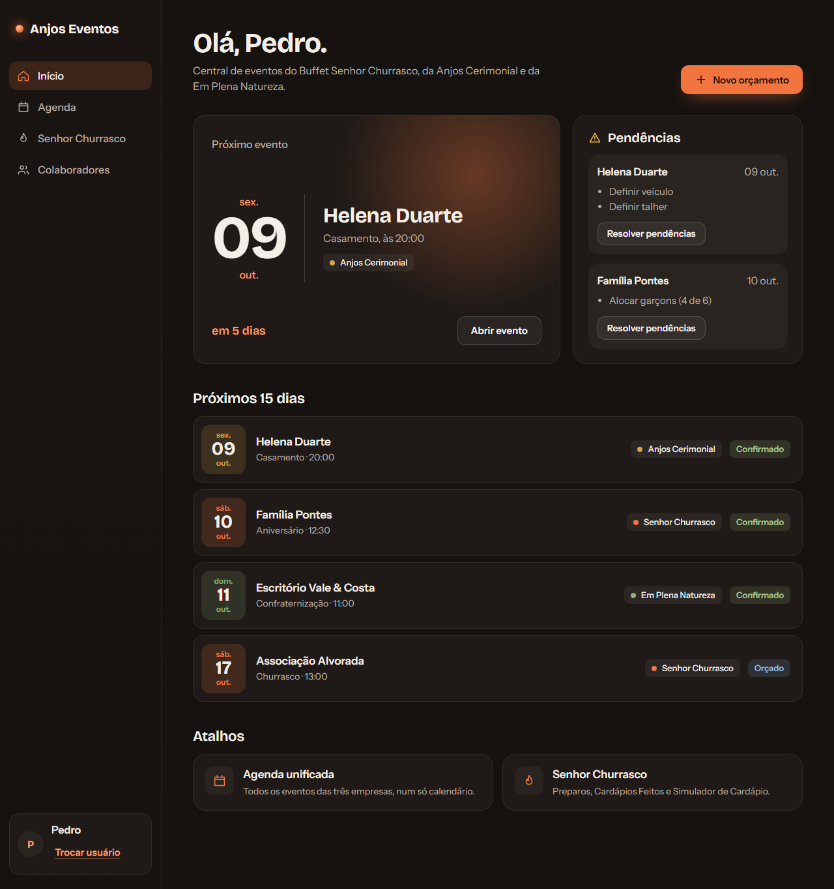
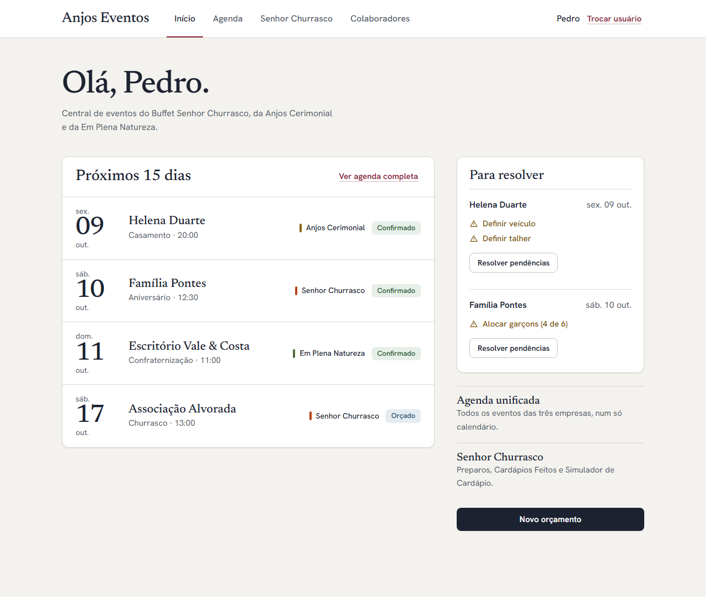
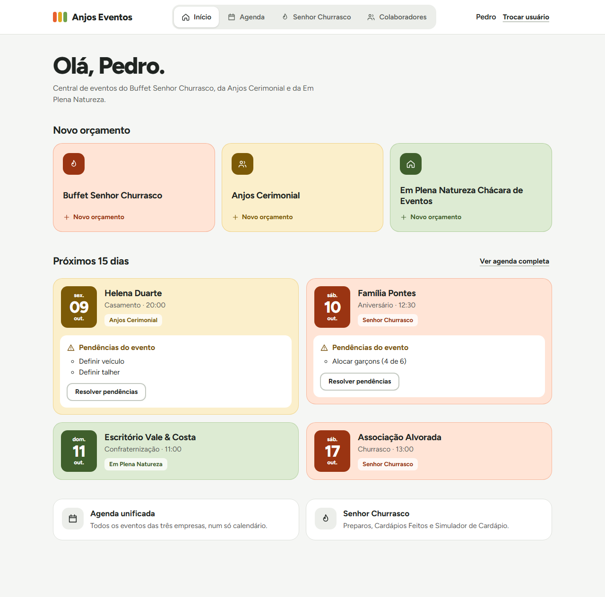

# Redesign 2: Etapa 0, direção visual (proposta)

Branch `redesign-ui-2`, criada a partir da `master` em `ee49970` (Merge do PR #10, que contém `e512d90` e a `snapshot-2026-09-22`). Esta etapa só adiciona arquivos em `docs/design/`: nada em `src/`, nada instalado, sem merge, sem deploy.

**Como ver os protótipos:** abra `docs/design/prototipos/index.html` no navegador (Home de cada direção em desktop e 390 px, com links para lista, formulário e modal). Cada página é HTML+CSS estático, responsiva, com dados fictícios. A auditoria do visual atual está em `docs/design/prototipos/auditoria/index.html`.

Verificado nesta etapa: os protótipos foram abertos no Chrome (headless) em 1280 px e 390 px e conferidos por captura de tela; os contrastes foram calculados por script (fórmula WCAG 2.x). **Não verificado:** aparelho real, leitor de tela, Tab real nos protótipos, impressão (os protótipos escondem header e barras em `@media print`, mas a Ficha Técnica real não foi tocada nem testada nesta etapa).

---

## 0. Decisões que dependem de você (resumo)

1. Qual direção (§4): **recomendo a Direção 3, "Casas"**.
2. Aprovar `next/font/local` como primeira etapa de implementação (§1).
3. Valor do cartão "em N dias" e outras pequenas derivações de apresentação (§7).
4. Se o Radix entra já (Dialog no lugar do `Modal` atual) ou só quando uma tela precisar (§6).

---

## 1. Pré-requisito: fontes dentro do repositório

O build no `ender` já falhou 2 vezes seguidas por não alcançar `fonts.googleapis.com` (`docs/PENDENCIAS_NOTURNAS.md`, "Build no `ender`"). Proposta: trocar `next/font/google` por `next/font/local`, com os `.woff2` versionados (ex.: `src/app/fonts/`).

- **API confirmada na documentação do Next instalado** (`node_modules/next/dist/docs/01-app/03-api-reference/02-components/font.md`): `src` aceita string ou array `{path, weight, style}` relativo ao arquivo que chama; `weight` e `style` valem para fontes locais; `display` e `preload` também. `subsets` é só do `next/font/google`, então o arquivo já deve ser o recorte latino.
- **Arquivos já baixados** para os protótipos em `docs/design/prototipos/fontes/` (Fontsource via jsDelivr, subset latin, pesos estáticos; acentos de pt-BR renderizam nas capturas).

| Direção | Famílias e pesos | Peso total (woff2) |
|---|---|---|
| 1 Brasa | Bricolage Grotesque 600, 700; Instrument Sans 400, 500, 600 | ~94 KB |
| 2 Linho | Newsreader 400, 500, 400 itálico; Hanken Grotesk 400, 500, 600 | ~109 KB |
| 3 Casas | Figtree 400, 500, 600, 700, 800 | ~56 KB |

- **A Ficha Técnica depende das fontes atuais.** Ela usa `font-display` (Fraunces itálico) e herda a fonte do `body` (Archivo). Se o redesign trocar `--font-display`/`--font-sans` ou o `font-family` do `body`, **a impressão muda**, o que o limite 2 proíbe. Mitigação proposta: não reaproveitar esses nomes (criar `--font-titulo` e `--font-texto`), manter Fraunces (400 normal e itálico) e Archivo (400, 500) carregadas localmente (~69 KB estáticos) e fixar a fonte antiga para a Ficha com uma regra no padrão já usado no projeto: `body:has(.sem-animacao) { font-family: ... }`.
- **Custo:** ~56 a 109 KB de binário no Git por direção, mais ~69 KB das fontes antigas enquanto a Ficha existir. Atualização manual.
- **Licença:** as famílias são OFL, mas confira o arquivo de licença de cada pacote do Fontsource antes de versionar (não li as licenças nesta etapa).
- **Risco:** baixo. Aparência igual à do Google Fonts; build sem rede.

---

## 2. Auditoria: o que está feio e por quê

As capturas são de uma **réplica estática** (mesmos tokens de `globals.css` e mesmas classes dos componentes) sobre fundo neutro, porque o app real só roda com o banco de produção e mostraria nomes de clientes (limite 7). Pode haver diferença de poucos pixels em relação ao app.



Versão 390 px: `capturas/auditoria-390.png`.

| Componente | O que se vê | Por que parece "CRUD" |
|---|---|---|
| Forma em geral | Raio de 2 px em botão, campo, painel, alerta e modal (50 ocorrências em 28 arquivos) | Tudo é retângulo; botão, campo e cartão têm a mesma forma, então a forma não diz o que é clicável. Sem hierarquia de raio |
| `Painel` e moldura | Painel marrom `ink-soft` dentro de moldura marrom `ink`, dentro da página | Caixa dentro de caixa da mesma cor; só uma linha fina separa os níveis |
| Dois mundos | Formulários em superfície escura; listas e cartões em "papel" claro com sombra pesada | Duas linguagens (escuro vs. claro) sem regra visível de quando usar cada uma |
| Tipografia | Fraunces itálico, peso único, em título de página, seção, cartão e modal | O tom de "convite" aparece até na tela de Valores; a hierarquia depende só do tamanho |
| `Botao` | Primário em terracota escura sobre fundo marrom; secundário só borda; "link" sublinhado | Baixo contraste de valor entre primário e fundo; botão e link parecem iguais ao toque |
| `Campo` | `ink-soft` sobre `ink-soft`, só a borda `#8a7d68` delimita | O campo some no painel; sem estado visual forte de hover ou foco além do anel |
| `Alerta` | Tinta a 10% com borda e ícone de 16 px | Funciona, mas é a mesma caixa de 2 px: erro e aviso não "pesam" diferente |
| `Vazio` | Texto pequeno e um botão sobre papel | Sem relação visual com a ação; parece erro de carregamento |
| Modal | Caixa escura de 2 px sobre fundo preto a 70% | Pouca noção de camada; título em itálico serifado |
| Header | Marca em itálico latão de 18 px, quatro textos, "Trocar usuário" sublinhado; em 390 px "Senhor Churrasco" quebra em duas linhas | Sem ícones nem forma de aba; o item ativo é só um sublinhado de 2 px |
| Lista | Linhas de papel com divisores; empresa = ponto de 10 px; status e valor em cinza pequeno | Os dados mais importantes (status e valor) têm o menor destaque |
| Cartões da Home | Cartão de evento e cartão de atalho têm a mesma forma, com faixa de 6 px | Atalho e evento parecem a mesma coisa; hover sobe 4 px sem dizer nada |
| Home | Título centralizado e coluna única; pendências ficam dentro dos cartões | A informação que pede ação (pendências) está escondida |
| Formulário | 10 seções em coluna única, botão de salvar só no fim da página (`formulario-evento-churrasco.tsx`, linha 744) | Sem índice nem barra de ação visível; rolar 3000 px para salvar |
| Movimento | Só entrada de página e modal | A interface não responde ao que o usuário faz além do pressionar |

---

## 3. Três direções

Todas respeitam: contraste AA, alvos de 44 px no mobile, foco visível, `prefers-reduced-motion`, impressão (header e barras escondidos por `@media print`), e nenhum `backdrop-filter`. Razão de contraste calculada por script para **todo** par de cor usado nos protótipos (tabelas abaixo; mínimo 4,5:1 para texto e 3:1 para forma de controle e ícone). O CSS de cada protótipo está em `docs/design/prototipos/direcao-N/style.css`.

Tokens de motion (iguais nas três, exceto a curva): microinteração 120 a 130 ms, componente 200 ms, overlay 260 ms; com `prefers-reduced-motion: reduce` toda animação e transição é desligada.

### Direção 1: Brasa (escura, quente, macia)

**Princípio.** A noite do evento e a brasa do churrasco: fundo grafite quente, uma única cor viva (brasa) para o que é ação, cantos generosos. Justificativa de produto: a equipe usa o celular em salão e à noite, e o Senhor Churrasco é fogo; **ressalva:** em chácara ao sol, tema escuro lê pior (não testei em campo).

**Navegação.** Rail lateral no desktop (marca, quatro itens com ícone, usuário e "Trocar usuário" embaixo); no celular, barra de abas fixa embaixo (64 px, ícone e rótulo).

**Personalidade.** O próximo evento vira o herói da Home, com brilho de brasa e data gigante; o resto é calmo.



| | Valor | |
|---|---|---|
| Fundo / superfície / elevada | `#151210` / `#1f1a17` / `#2a2420` | overlay `rgba(10,7,6,.72)` |
| Texto / texto suave | `#f4eee8` / `#b9ada2` | 16,2 / 8,5 sobre o fundo |
| Ação (fundo, texto) | `#f2753f`, `#1a0e08` | 6,66; hover `#ff8a57`: 8,13 |
| Link, foco | `#ff9a6b`, `#ffc089` | link 8,28 sobre a superfície; foco 10,8 |
| Perigo / aviso / sucesso / info | `#ff8c98` / `#f2c14e` / `#a8c48f` / `#8dbbe0` | 7,76 / 10,27 / 8,99 / 8,47 sobre a superfície |
| Empresas | churrasco `#f2753f`, cerimonial `#d9a441`, chácara `#8db27a` | 6,07 / 7,66 / 7,21 |
| Borda de controle | `#8a7e73` | 4,36 sobre a superfície; 3,87 sobre a elevada |

Pares compostos (texto sobre tinta translúcida, calculados com a cor já misturada): data sobre tile 4,74 / 5,69 / 5,43; chip de status 6,75 / 6,43 / 6,03; botão de perigo 8,54; item de menu ativo 12,45.

- **Tipografia:** Bricolage Grotesque 700 nos títulos (30 a 42 px, espaçamento -0,025em), 600 em seções (20 a 22 px); Instrument Sans 400/500/600 no texto (16 px, 14 px, 13 px). Números tabulares nos valores.
- **Raio:** controle 12, linha de lista 16, cartão 20, modal 28 (folha inferior no celular), chip 8, tile de data 14. Só o avatar é círculo.
- **Superfícies:** fundo, superfície e elevada em degraus de luminosidade; separação por borda `rgba(255,255,255,.08)` e realce interno de 1 px, sem sombra de cartão.
- **Elevação:** só o modal e a barra de salvar têm sombra (`0 32px 80px -20px rgba(0,0,0,.75)`); o botão primário tem brilho laranja difuso.
- **Motion:** curva `cubic-bezier(.2,.8,.2,1)`; hover de linha muda fundo e borda; modal sobe 14 px e aparece em 260 ms.

### Direção 2: Linho (clara, editorial, firme)

**Princípio.** O evento como programa impresso e o orçamento como folha de contrato: tipografia serifada grande para datas e títulos, linhas finas no lugar de caixas, uma cor de assinatura (vinho) só em link, aba ativa e foco. Justificativa de produto: há dinheiro e contrato em jogo; a interface precisa passar sobriedade e deixar o número legível.

**Navegação.** Header superior claro com marca serifada, abas de texto com sublinhado vinho na ativa e usuário à direita; no celular, a linha de abas rola na horizontal (os quatro itens a 14 px cabem em 390 px, no limite; com um nome de item maior passaria a rolar).

**Personalidade.** O dia do evento em serifa de 46 px, como numeração de programa; formulário em seções de duas colunas (título à esquerda, campos à direita).



| | Valor | |
|---|---|---|
| Fundo / superfície / rebaixada | `#f3f2ee` / `#ffffff` / `#eceae3` | overlay `rgba(28,34,48,.45)` |
| Texto / suave | `#1c2230` / `#545b6a` | 14,19 / 6,08 sobre o fundo |
| Ação (fundo, texto) | `#1c2230`, `#ffffff` | 15,90; hover `#2e3750`: 11,81 |
| Assinatura (link, foco, aba ativa) | vinho `#8a2638` | 7,76 sobre o fundo; 8,70 sobre branco |
| Perigo / aviso / sucesso / info | `#b42318` / `#7a5410` / `#2f5d3a` / `#2f5775` | 6,57 / 6,77 / 7,64 / 7,66 sobre branco |
| Empresas (barrinha) | `#b8431a` / `#8a6414` / `#4f6b3f` | 5,45 / 5,37 / 5,99 |
| Borda de controle | `#7e8493` | 3,74 sobre branco; 3,34 sobre o fundo |

Pares compostos: chip de status 6,51 / 6,41 / 5,43 / 5,66; botão de perigo 6,57 (hover 8,08).

**Atenção:** vinho (assinatura) e vermelho de perigo ficam na mesma família. Por isso o perigo sempre leva ícone e texto, e o botão destrutivo é sólido; nunca só cor.

- **Tipografia:** Newsreader 500 nos títulos (40 a 58 px) e nos números; Hanken Grotesk 400/500/600 no texto (16 px, 15 px, 14 px).
- **Raio:** controle 8, cartão 12, modal 16, chip 6.
- **Superfícies:** fundo porcelana, folha branca com sombra suave, área rebaixada para chips.
- **Elevação:** `0 1px 2px` + `0 1px 1px` nas folhas; `0 24px 60px -16px` no modal; barra de salvar com sombra para cima.
- **Motion:** curva `cubic-bezier(.25,.6,.3,1)` (mais calma); modal entra com 8 px de deslocamento.

### Direção 3: Casas (clara, viva, uma cor por empresa)

**Princípio.** Cada empresa é uma "casa" com cor própria, e essa cor aparece em todo lugar onde a empresa aparece (data do evento, cartão, atalho de novo orçamento, faixa do formulário). Botões e controles ficam neutros (grafite), então cor sempre significa empresa. Justificativa de produto: a operação atende três empresas e o `UX-AUDIT` já registrou que hoje a mesma cor serve para empresa, ação e erro; aqui a cor passa a identificar quem é o evento num relance, em celular.

**Navegação.** Header superior claro com abas em "segmento" (ícone e texto; ativa vira ficha branca com sombra); no celular, o segmento ocupa a largura toda com ícone sobre o rótulo (56 px).

**Personalidade.** Cartões de evento tingidos na cor da empresa com tile de data forte; as três "casas" da Home viram atalhos de **Novo orçamento** por empresa.



| | Valor | |
|---|---|---|
| Fundo / superfície / rebaixada | `#f5f6f4` / `#ffffff` / `#eceeea` | overlay `rgba(31,36,33,.5)` |
| Texto / suave | `#1f2421` / `#596058` | 14,54 / 5,98 sobre o fundo |
| Ação (fundo, texto) | `#1f2421`, `#ffffff` | 15,76; hover `#363d38`: 11,16 |
| Foco | `#1f2421`, anel de 3 px | 14,54 sobre o fundo |
| Perigo / aviso / sucesso / info | `#b42318` / `#7a5410` / `#2f5d3a` / `#2f5775` | 6,57 / 6,77 / 7,64 / 7,66 sobre branco |
| Churrasco (forte / tinta) | `#9a3412` / `#ffe4d6` | forte sobre tinta 6,03; texto sobre tinta 13,00; suave sobre tinta 5,35 |
| Cerimonial (forte / tinta) | `#7c5a07` / `#fbefcb` | 5,51; 13,74; 5,65 |
| Chácara (forte / tinta) | `#3f5f2c` / `#ddebd3` | 5,86; 12,68; 5,22 |
| Borda de controle | `#858c83` | 3,46 sobre branco; 3,19 sobre o fundo |

Pares compostos: data branca sobre tile 7,31 / 6,32 / 7,28; chip de empresa (cor forte sobre branco a 75% na tinta) 6,96 / 6,11 / 6,91; chip de status sobre branco 7,64 / 7,66 / 6,57 / 6,48. As bordas tingidas dos cartões (1,3 a 1,5:1) são decoração; o cartão é identificado pelo texto e pelo tile, nunca só pela borda.

- **Tipografia:** Figtree 800 em títulos (34 a 50 px, espaçamento -0,035em), 700 em seção e nome (19 a 22 px), 500/600 no texto (15 a 16 px). Uma família só.
- **Raio:** controle 12, cartão 20, modal 24, tile 14, chip 8.
- **Superfícies:** fundo neutro frio, superfícies brancas e tintas por empresa; sem sombra nos cartões.
- **Elevação:** só o modal; o hover sobe 2 a 3 px com sombra tingida.
- **Motion:** curva padrão `cubic-bezier(.25,.8,.3,1)` e uma curva com leve mola (`.34,1.4,.64,1`) só em pressionar, hover e abertura do modal; sem ela em entrada de página.
- **Risco visual:** em listas longas (Agenda "Em sequência"), cartões tingidos viram uma parede colorida. Mitigação a validar com você: em listas densas, tingir só o tile de data e manter o cartão branco.

### Protótipos: o que cada um mostra

| Página | Direção 1 | Direção 2 | Direção 3 |
|---|---|---|---|
| Home | `direcao-1/index.html` | `direcao-2/index.html` | `direcao-3/index.html` |
| Lista (Agenda, "Em sequência") | `agenda.html` | `agenda.html` | `agenda.html` |
| Formulário longo (Novo orçamento, Senhor Churrasco) | `novo-evento.html` | `novo-evento.html` | `novo-evento.html` |
| Modal (excluir evento) | `modal.html` | `modal.html` | `modal.html` |
| Header em desktop e 390 px | em todas as páginas (redimensione) | idem | idem |

Capturas prontas em `docs/design/capturas/` (`dN-home|lista|formulario|modal-desktop|390.png`). O formulário usa os rótulos reais de `formulario-evento-churrasco.tsx`; select nativo estilizado em todas as direções; erro de campo demonstrado no Celular.

---

## 4. Recomendação

**Direção 3, "Casas".** Motivos:

1. Resolve um problema que a auditoria identificou no próprio produto (cor com vários significados) em vez de só trocar de estilo.
2. É a que mais foge de "CRUD quadrado": cantos de 12 a 24 px, cartões com cor, mola leve; a Direção 2 é mais refinada mas continua sóbria e parada.
3. Clara, o que lê melhor ao sol (chácara) e imprime sem choque com a Ficha Técnica; a Direção 1 é bonita, mas escura e a mais cara.
4. Mantém o header no topo e a estrutura de páginas atual (não precisa de rail), então a migração é de tokens e componentes, não de layout.
5. Uma família tipográfica só (56 KB).

**O que cada uma custa de implementar** (a superfície medida hoje: 35 componentes, 20 páginas, 44 arquivos com os tokens de cor atuais, 50 usos de `rounded-[2px]` em 28 arquivos, 23 `<main class="venue-glow ...">`):

| | Direção 1 Brasa | Direção 2 Linho | Direção 3 Casas |
|---|---|---|---|
| Mudança de estrutura | **Alta**: rail lateral exige um wrapper no `layout.tsx`; cada `<main>` define o próprio `px-6 py-16`, que conflita com o rail | Baixa | Baixa |
| Tema | Continua escuro, mas os cartões de papel (`bg-paper`) viram superfícies escuras | Inverte para claro: os nomes `ink`/`paper` passam a mentir; migrar 44 arquivos para tokens semânticos | Idem Direção 2 |
| Dependência nova | Nenhuma obrigatória | Nenhuma obrigatória | Nenhuma obrigatória |
| Fontes | 5 arquivos, ~94 KB | 6 arquivos, ~109 KB | 5 arquivos, ~56 KB |
| Componentes novos | Rail e barra de abas (client), cartão herói | Pouco: linha de programa | Cartão por empresa, `ChipEmpresa`, atalho "casa" |
| Risco principal | Contraste sobre translúcidos, tema escuro ao sol, rail em todas as páginas | Vinho vs. perigo; aba rolável no celular | Parede colorida em lista longa; 3 tintas × estados |
| Esforço relativo | Maior | Médio | Médio |

---

## 5. Avaliação do shadcn/ui

**Compatibilidade (documentação oficial, consultada em 2026-10-04):**
- `ui.shadcn.com/docs/tailwind-v4`: o CLI inicializa projetos com Tailwind v4, suporta `@theme` e `@theme inline`; os componentes foram atualizados para Tailwind v4 e React 19 (sem `forwardRef`, com `data-slot`).
- `docs/installation/next` e `docs/react-19` falam de Next.js 15 e React 19. **A página de instalação não menciona Next.js 16.** O app usa Next 16.3.4, React 19.2.8 e Tailwind 4, então a compatibilidade com Next 16 **não está confirmada pela documentação**: precisa de um teste num branch descartável (`add` de um componente e build no `ender`) antes de qualquer commit em `src/`.
- Pacotes do Radix e `cmdk` declaram React 19 nos `peerDependencies` (conferido no registro do npm). Nenhum deles depende do Next.
- O CLI atual (4.8.3 na página de CLI) tem `add --dry-run`, `add --diff` e `add --view`, que mostram o que mudaria antes de gravar. A página de CLI também mostra que o `globals.css` gerado importa `tw-animate-css` e `shadcn/tailwind.css`, ou seja, **entra pelo menos um pacote a mais** além dos componentes (`shadcn eject` embute esse CSS).

**O que migrar para Radix/shadcn, o que manter**

| Peça | Recomendação | Motivo |
|---|---|---|
| `Botao`, `Campo`, `Alerta`, `Painel`, `Vazio`, `BotaoEnviar` | **Manter customizado** (reestilizar por dentro, mesma API) | São o contrato dos formulários (`name`, ordem e tipo dos campos não podem mudar); `Campo` usa render-prop com `aria-describedby` e erro; trocar custaria mais do que ganha |
| `select` nativo | **Manter nativo estilizado** | Melhor no celular e já é o que os formulários enviam (`FormData`) |
| `Modal` / `ModalConfirmacao` | **Opcional, em etapa própria**: mesma API, Radix Dialog por dentro | O `Modal` atual já tem portal, foco preso e devolvido, Esc, clique fora, rolagem travada e foco inicial por `data-foco-inicial`; Radix tira ~100 linhas próprias, mas muda detalhes (saída animada, `onOpenAutoFocus`, compensação da barra de rolagem). Ganho de acessibilidade pequeno; só migrar se valer a manutenção |
| Dropdown Menu | **Só quando uma tela usar** | Hoje o app não tem menu suspenso; candidato real: menu do usuário no header (Trocar usuário, WhatsApp) em tela estreita |
| Tooltip | **Só quando uma tela usar** | Para nomes truncados e ícones sem rótulo; nunca como único jeito de ler uma informação (celular não tem hover) |
| Popover | **Só quando uma tela usar** | Filtros da agenda (que dependem de lógica, §7) |
| Command (`cmdk`) | **Candidato para o seletor de preparos e itens** | São as listas longas do app; hoje o seletor tem abas por categoria e nenhuma busca (`seletor-preparos.tsx`); busca é comportamento novo (§7) |
| Toasts (`sonner`) | **Não nesta fase** | Depende de "sucesso após salvar" (§7) |
| Ícones | **Manter SVG inline** | `lucide-react` pesa ~189 KB gzip (pacote inteiro, medido pelo bundlephobia; com import nomeado o custo é por ícone, mas ainda é uma dependência a mais para ~10 ícones) |
| `motion` | **Não usar** | ~46 KB gzip; CSS resolve todos os movimentos propostos |

**Dependências, custo e risco** (gzip do pacote isolado, conforme bundlephobia em 2026-10-04; ao instalar vários, as dependências compartilhadas, como `floating-ui` e `react-remove-scroll`, contam uma vez só, então a soma real é menor que a soma da tabela):

| Pacote | Versão vista | gzip | Para quê | Risco |
|---|---|---|---|---|
| `class-variance-authority` | 0.7.1 | 0,6 KB | Variantes de `Botao` | Baixo |
| `clsx` | 2.1.1 | 0,3 KB | Juntar classes | Baixo |
| `tailwind-merge` | 3.7.0 | 8,9 KB | Resolver conflito de classes (`cn()`) | Baixo; só vale com `cva` |
| `@radix-ui/react-dialog` | 1.1.23 | 12,3 KB | Modal | Médio (foco e rolagem) |
| `@radix-ui/react-dropdown-menu` | 2.1.24 | 28,7 KB | Menu do usuário | Baixo |
| `@radix-ui/react-tooltip` | 1.2.16 | 17,8 KB | Dicas | Baixo |
| `@radix-ui/react-popover` | 1.1.23 | 22,1 KB | Filtros | Baixo |
| `cmdk` | 1.1.1 | 14,6 KB | Busca em lista longa | Baixo; precisa de estilo próprio |
| `tw-animate-css` | 1.4.0 | n/d | CSS de animação que o shadcn importa | Baixo; **não medido** |
| `radix-ui` (pacote único) | 1.6.7 | 70,1 KB (tudo) | Alternativa aos pacotes separados | Evitar: traz o que não se usa |

**Regras de instalação (propostas):**
1. Nunca rodar `shadcn init` sem eu ver o diff: ele mexe no CSS global. Se for preciso, criar `components.json` e `src/lib/utils.ts` à mão e só então `add`.
2. Um componente por vez, sempre com `npx shadcn@latest add <componente> --dry-run` e `--diff` antes, e commit separado.
3. Conferir o que cada `add` altera em `globals.css` (variáveis de tema novas, imports) e rejeitar o que reescrever tokens do projeto.
4. Os componentes ficam em `src/components/ui/` e **não substituem** `Botao`, `Campo`, `Modal` (a API atual fica); só trabalham por dentro deles ou ao lado.
5. Radix só entra onde a tela precisa (Dialog, Dropdown, Tooltip, Popover, Command); nada instalado "por precaução".
6. Antes do primeiro `add`: build no `ender` em branch descartável, por causa de Next 16 sem confirmação na documentação.

---

## 6. Home como composição (só dados que já existem)

A Home de hoje carrega: nome do usuário, `listarEventosProximos(15)` (`id`, `cliente`, `empresa_id`, `empresa_nome`, `data_evento`, `tipo_evento`, `status`; **sem valor**), `itensPendenciaPorEvento` e, se houver pendência, `listarColaboradoresAtivos` (para `BotaoResolverPendencias`).

Composição proposta (Direção 3; a 1 e a 2 usam os mesmos blocos em outro desenho):

```
Olá, {nome}.
Central de eventos do Buffet Senhor Churrasco, da Anjos Cerimonial e da Em Plena Natureza.

Novo orçamento
[ Senhor Churrasco ] [ Anjos Cerimonial ] [ Em Plena Natureza ]   (3 atalhos, cor da empresa)

Próximos 15 dias                                   Ver agenda completa
[ 09 | Helena Duarte        ] [ 10 | Família Pontes        ]
[ sex| Casamento · 20:00    ] [ sáb| Aniversário · 12:30   ]
[      Pendências do evento ] [      Pendências do evento  ]
[      - Definir veículo    ] [      - Alocar garçons (4/6)]
[      [Resolver pendências]] [      [Resolver pendências] ]
...
Atalhos:  Agenda unificada | Senhor Churrasco
```

| Bloco | Dado | Existe hoje? |
|---|---|---|
| Saudação | nome do usuário | Sim |
| Próximos eventos | `cliente`, `data_evento` (data e hora), `tipo_evento`, `empresa_nome`, `status` | Sim |
| Pendências | `itensPendenciaPorEvento` (texto dos itens) e `BotaoResolverPendencias` | Sim; mesmo componente e mesmas props |
| Atalhos | links para `/agenda` e `/senhor-churrasco` | Sim (já existem hoje) |
| Novo orçamento por empresa | links para `/agenda/novo?empresa=<id>` | A rota existe. **O id de cada empresa vem de `listarEmpresas()`** (hoje usada em `agenda/novo/page.tsx`), então a Home passaria a chamar uma função que já existe; precisa do seu OK |
| Valor do evento na Home | | **Não** (`EventoProximo` não traz valor): os protótipos não mostram valor na Home |

Direção 1 acrescenta o "Próximo evento" em destaque (primeiro item da mesma lista) e a Direção 2 coloca as pendências numa coluna lateral; nenhuma exige dado novo.

---

## 7. PRECISA DE LÓGICA, NÃO IMPLEMENTAR

Itens que apareceriam bem no visual, mas exigem lógica, query ou action nova. **Nada abaixo está nos protótipos como funcionalidade** (onde aparece um elemento estático, está marcado).

- Paginação de tabela ou lista.
- Ordenação de tabela.
- Filtro por empresa ou por status na Agenda (chips ou Popover). Nos protótipos as abas "Agenda / Em sequência" repetem o que já existe; não há filtro.
- Atividade recente (qualquer feed).
- Cartões de resumo com totais (valor do mês, quantidade de eventos): exigiriam query nova.
- Mensagem de "sucesso" após salvar, toast ou redirecionamento com aviso.
- Recuperação de erro nos formulários principais (manter os valores digitados após erro de servidor) e foco no primeiro campo com erro. Nos protótipos o erro de campo (Celular) é só um estado estático do `Campo`, que já aceita `erro`.
- Busca dentro dos seletores de preparos e cardápio (Command/`cmdk`): é comportamento novo, ainda que seja filtro no cliente sobre a lista já carregada.
- Índice do formulário que acompanha a rolagem (item ativo) e contagem de campos preenchidos: exige JavaScript novo. No protótipo da Direção 1, o índice lateral só tem âncoras.
- Total do evento ou do orçamento exibido ao vivo na barra de salvar (cálculo): **fora de questão**; a barra dos protótipos só tem "Cancelar" e "Salvar orçamento".
- Agrupar a lista por semana ou mês (cabeçalhos de grupo).
- Estado "salvando" com porcentagem ou desfazer exclusão.
- Cartão "em N dias" (Direção 1): é só diferença entre `data_evento` e hoje, sem query, mas é uma regra de apresentação nova (fuso, "hoje", "amanhã"); só entra com seu OK. Se não aprovado, o cartão mostra só a data.
- Avatar do usuário com inicial (Direção 1): derivado do nome já carregado; trivial, mas listado por ser elemento novo.

---

## 8. Riscos

| Risco | Onde | Mitigação proposta |
|---|---|---|
| **Impressão da Ficha Técnica** muda sem querer | Fonte do `body` e `--font-display` (a Ficha usa os dois); `@media print` em `globals.css`; transições globais | Não reutilizar os nomes de token de fonte; fixar a fonte antiga na Ficha com `body:has(.sem-animacao)`; todo header, rail e barra com `print:hidden`; estilos novos de fundo, raio, sombra e movimento **só dentro de `@media screen`** ou escopados fora de `.sem-animacao`; comparar PDF da Ficha (1 e N preparos) antes e depois de cada etapa. A Ficha hoje não usa nenhuma classe dos tokens de cor atuais (conferido por busca), o que ajuda |
| **`backdrop-filter` e `transform` quebram `position: fixed`** (já quebraram o modal) | Hover de cartão (`translate`), animações de entrada (`transform` residual), rail e barra de abas fixas | Nenhum protótipo usa `backdrop-filter`; manter modal em portal no `<body>` (já é); usar a propriedade `translate`/`scale` (não `transform`) em hover e pressionar; animações de entrada com `animation-fill-mode: backwards` (já é a regra do projeto); barras fixas (`barra-acoes`, abas) ficam fora de qualquer ancestral com `transform`, `filter` ou `overflow` |
| **Smoke test do deploy** | `loading.tsx`, header | Página protegida sem sessão continua devolvendo 307 ou 200 com `NEXT_REDIRECT` e sem `<h1>`; **nenhum `loading.tsx` novo**; o esqueleto do raiz não pode ter `<h1>`; o header novo não pode conter `<h1>` (os protótipos usam `<h1>` só no conteúdo da página) |
| **Build no `ender`** | `next/font/google` falha por rede | Etapa 0 do plano: `next/font/local`; build no `ender` a cada etapa |
| **Next 16 + shadcn não confirmado** | `add` de componentes | Teste em branch descartável antes (§5) |
| **Tema claro inverte nomes** (`ink`, `paper`) | 44 arquivos | Migrar para tokens semânticos por etapa pequena, sem renomear tokens que a Ficha use |
| **Contraste de cor nova** | Todas as direções | Rodar de novo o script de contraste (os pares estão nas tabelas §3) a cada token que entrar; qualquer cor fora delas precisa ser calculada |
| **Estado de foco** | Controles sobre superfícies diferentes | Direção 1: anel `#ffc089`; Direção 2: vinho; Direção 3: grafite de 3 px; verificar sobre cada superfície |
| **Alvo de 44 px** | Botões `sm`, abas, chips clicáveis | Os protótipos usam 44 px no celular e 36 a 42 px no desktop; confirmar em medição real na implementação |
| **Zoom do iOS em campos** | Campos de 16 px | Mantidos em 16 px; não testado em aparelho |
| **Parede colorida** | Direção 3, listas longas | Tingir só o tile em listas densas (validar com você) |

---

## 9. Plano de implementação em etapas pequenas

Cada etapa: um commit (ou poucos), verificação (`tsc --noEmit`, `eslint`, `vitest`, `next build` no `ender`, smoke test sem sessão, capturas em 390, 768 e 1280 px), e **pausa para você aprovar** antes da seguinte. Todas dependem da direção escolhida e do seu "continue".

0. **Fontes locais** (`layout.tsx` e `src/app/fonts/`): `next/font/local` para as fontes da direção e as antigas da Ficha. Verificação: build sem rede, Ficha idêntica (PDF), smoke test.
1. **Tokens em `globals.css`** (cores, raio, sombra, movimento, fonte) com nomes novos, sem remover os antigos. Nenhum componente muda. Verificação: build, script de contraste, Ficha idêntica.
2. **Base: `Botao`, `BotaoEnviar`, `Campo`, `Alerta`, `Painel`, `Vazio`** (mesma API, nova pele; `cva` só se aprovado). Verificação: formulários com mesmos `name`, ordem e tipo (comparar o `FormData` como na Etapa 2 anterior), foco e alvos em 390 px.
3. **Modal e `ModalConfirmacao`** (aparência; Radix Dialog só se aprovado, em commit à parte). Verificação: foco preso, Esc, clique fora, rolagem travada, foco devolvido.
4. **Header e navegação** (e `IndicadorWhatsapp`, `Trocar usuário`, skip link, `aria-current`). Verificação: smoke test, ordem de foco, `print:hidden`, 390 px sem quebra de linha.
5. **Listas e cartões** (`lista-eventos`, `lista-preparos`, `lista-insumos`, `lista-cardapios-modelo`, cartões da Home, `calendario-eventos`). Verificação: contraste dos chips, estados vazios.
6. **Formulários** (seções, barra de salvar, select nativo estilizado): um formulário por commit, começando por Novo orçamento (Senhor Churrasco). Verificação: payload idêntico, erro de campo, Tab.
7. **Home recomposta** (§6), só com dados existentes; `listarEmpresas()` só se aprovado.
8. **Demais telas** (preparos, insumos, colaboradores, simulador, cardápios feitos, login) e estados (`loading`, vazio, erro), sem `loading.tsx` novo.
9. **Verificação final de impressão:** Ficha Técnica (1 e N preparos) em PDF, antes e depois; **nenhuma alteração** na Ficha.
10. **Documentação:** reescrever `docs/design/DESIGN-SYSTEM.md` e `.claude/skills/anjos-design-system/SKILL.md` para a direção escolhida, registrando o que mudou e por quê (§10). Só depois da escolha e da implementação, para não documentar o que não foi construído.

---

## 10. O que muda nos documentos de design (a registrar na Etapa 10)

Não reescrevi o `DESIGN-SYSTEM.md` nem a skill nesta etapa: eles hoje descrevem o visual em produção, e a direção ainda não foi escolhida. Quando for, o que muda, por seção:

- §2 Filosofia: a frase "Superfície clara para ler, moldura escura para orientar" cai (Direções 2 e 3) ou vira "tudo escuro" (Direção 1); "O caderno do maître" é substituída pelo princípio da direção.
- §4/§5 Cores: troca de paleta; `ember`/`brass`/`sage` deixam de ser a identidade de empresa na Direção 3 (viram forte/tinta/acento por empresa).
- §6 Tipografia: sai Fraunces itálico (fica só na Ficha); entra a família da direção.
- §8/§9 Raio e sombra: "raio de 2 px" deixa de ser regra; entra a escala de raio por papel.
- §11, §12 Componentes e navegação: aparência nova; a API de `Botao`, `Campo`, `Modal` não muda; Direção 1 também muda a decisão de §12.2 (sidebar "não adotar").
- A regra "sem nova dependência de UI/ícones" da skill passa a "dependência nova só com justificativa de custo e risco" (§5).
- `.claude/rules/design.md` e os limites de negócio **não mudam**.

---

## 11. Arquivos desta etapa

- `docs/design/REDESIGN-2-PROPOSTA.md` (este documento)
- `docs/design/prototipos/index.html`, `auditoria/`, `direcao-1/`, `direcao-2/`, `direcao-3/` (cada uma com `style.css` e `index.html`, `agenda.html`, `novo-evento.html`, `modal.html`) e `fontes/`
- `docs/design/capturas/` (auditoria e protótipos, desktop e 390 px)
